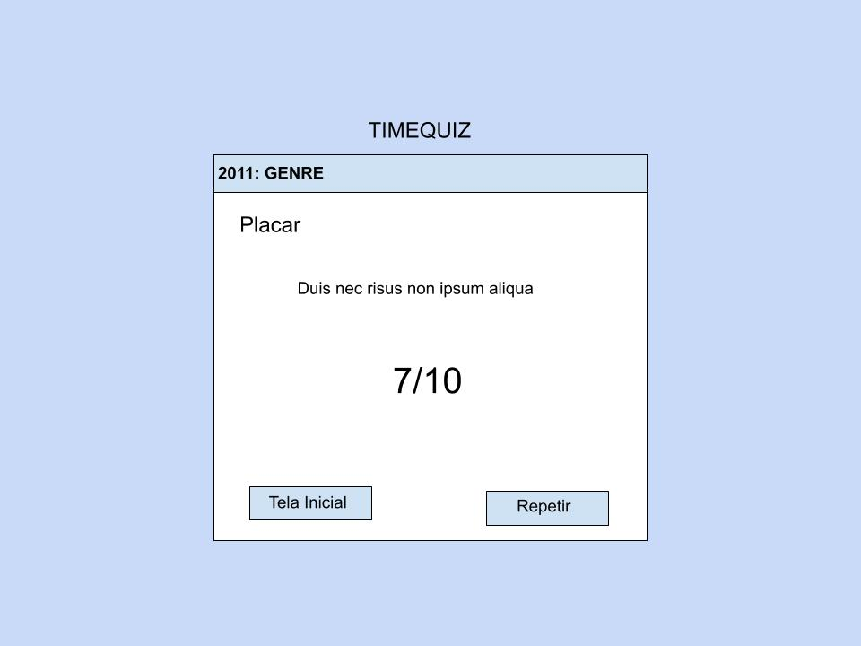

# Pontifícia Universiade Católica de Minas Gerais

Disciplina: Interação Humano-Computador

Professor: Lesandro Ponciano

Alunos: 

- Carlos Augusto Ramos Silveira
- Guilherme Gonçalves da Silva

Objetivos: Permitir que os alunos exercitem, em equipes, as atividades típicas do processo de design de IHC: análise da situação atual, proposta e prototipação de uma intervenção e avaliação do resultado da intervenção.

## Projeto

O projeto foi pensado em formato de um quiz, onde cada pergunta é relacionada com um ano e alguma informação relevante que aconteceu nesse ano, a idéia é que a cada pergunta respondida o sentimento de nostalgia e de o de conhecimentos passem, como se cada ano pudesse passar pela cabeça do úsuario participante do quiz.

O projeto foi baseado na música `Tempos modernos` do Lulu Santos.

### Personas

O público, ou personas selecionadas ao projeto foram de pessoas curiosas, seja com relação ao mundo ou de atividades que estimulem o raciocínio.


### Música

O projeto se baseia na música tempos modernos, tentando passa a idéia do tempo que não volta, mas que ainda olhamos em cima do muro e vemos sempre mais coisa pelo futuro, a cada pergunta, vemos o tempo indo e a cada nova descobrimos algo que está do outro lado do muro.

```
Tempos Modernos
Lulu Santos

Eu vejo a vida melhor no futuro
Eu vejo isso por cima de um muro
De hipocrisia que insiste em nos rodear

Eu vejo a vida mais clara e farta
Repleta de toda satisfação
Que se tem direito do firmamento ao chão

Eu quero crer no amor numa boa
Que isso valha pra qualquer pessoa
Que realizar a força que tem uma paixão

Eu vejo um novo começo de era
De gente fina, elegante e sincera
Com habilidade
Pra dizer mais sim do que não, não, não

Hoje o tempo voa, amor
Escorre pelas mãos
Mesmo sem se sentir
Não há tempo que volte, amor
Vamos viver tudo que há pra viver
Vamos nos permitir

Eu quero crer no amor numa boa
Que isso valha pra qualquer pessoa
Que realizar a força que tem uma paixão

Eu vejo um novo começo de era
De gente fina, elegante e sincera
Com habilidade
Pra dizer mais sim do que não, não, não

Hoje o tempo voa, amor
Escorre pelas mãos
Mesmo sem se sentir
Não há tempo que volte, amor
Vamos viver tudo que há pra viver
Vamos nos permitir

E não há tempo que volte, amor
Vamos viver tudo que há pra viver
Vamos nos permitir
```

### Casos de uso

- Tela inicial com aprensetanção e opção de avançar para o quiz.
- Pergunta com opções de resposta, a timeline é atualizada dependendo da resposta (certa ou errada) 
- O úsurio pode selecionar um dica e ela será apresentada para cada pergunta
- Tela com placa onde o úsurio pode retornar para a "home page" ou recomeçar o quiz

## WIREFRAMES




## MOLIC


## Questionário

[Questionário quiz](https://docs.google.com/forms/d/14VoG9kQ3kjuCkTfaZ8haCS4Qikw2P5svoDsFZDE99lI/edit#responses)


## Sobre o desenvolvimento

O desenvolvimento foi feito utilizando React Dom e para atender requisitos cobrados para o trabalho foi utilizado webpack para crianção de um bundle que é linkado ao index.html, podendo assim rodar o projeto offline sem a necessidade do npm.

# REACT

This project was bootstrapped with [Create React App](https://github.com/facebook/create-react-app).

## Available Scripts

In the project directory, you can run:

### `npm start`

Runs the app in the development mode.<br>
Open [http://localhost:3000](http://localhost:3000) to view it in the browser.

The page will reload if you make edits.<br>
You will also see any lint errors in the console.

### `npm test`

Launches the test runner in the interactive watch mode.<br>
See the section about [running tests](https://facebook.github.io/create-react-app/docs/running-tests) for more information.

### `npm run build`

Builds the app for production to the `build` folder.<br>
It correctly bundles React in production mode and optimizes the build for the best performance.

The build is minified and the filenames include the hashes.<br>
Your app is ready to be deployed!

See the section about [deployment](https://facebook.github.io/create-react-app/docs/deployment) for more information.

### `npm run eject`

**Note: this is a one-way operation. Once you `eject`, you can’t go back!**

If you aren’t satisfied with the build tool and configuration choices, you can `eject` at any time. This command will remove the single build dependency from your project.

Instead, it will copy all the configuration files and the transitive dependencies (Webpack, Babel, ESLint, etc) right into your project so you have full control over them. All of the commands except `eject` will still work, but they will point to the copied scripts so you can tweak them. At this point you’re on your own.

You don’t have to ever use `eject`. The curated feature set is suitable for small and middle deployments, and you shouldn’t feel obligated to use this feature. However we understand that this tool wouldn’t be useful if you couldn’t customize it when you are ready for it.

## Learn More

You can learn more in the [Create React App documentation](https://facebook.github.io/create-react-app/docs/getting-started).

To learn React, check out the [React documentation](https://reactjs.org/).

### Code Splitting

This section has moved here: https://facebook.github.io/create-react-app/docs/code-splitting

### Analyzing the Bundle Size

This section has moved here: https://facebook.github.io/create-react-app/docs/analyzing-the-bundle-size

### Making a Progressive Web App

This section has moved here: https://facebook.github.io/create-react-app/docs/making-a-progressive-web-app

### Advanced Configuration

This section has moved here: https://facebook.github.io/create-react-app/docs/advanced-configuration

### Deployment

This section has moved here: https://facebook.github.io/create-react-app/docs/deployment

### `npm run build` fails to minify

This section has moved here: https://facebook.github.io/create-react-app/docs/troubleshooting#npm-run-build-fails-to-minify
